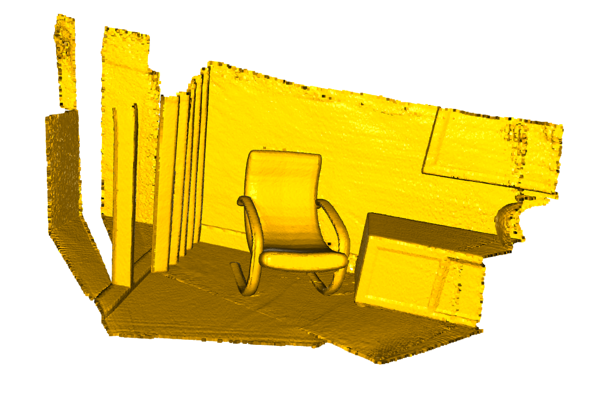
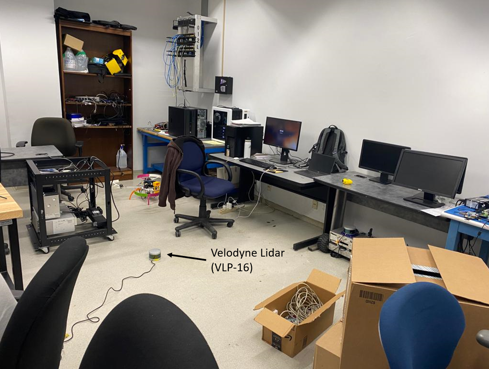
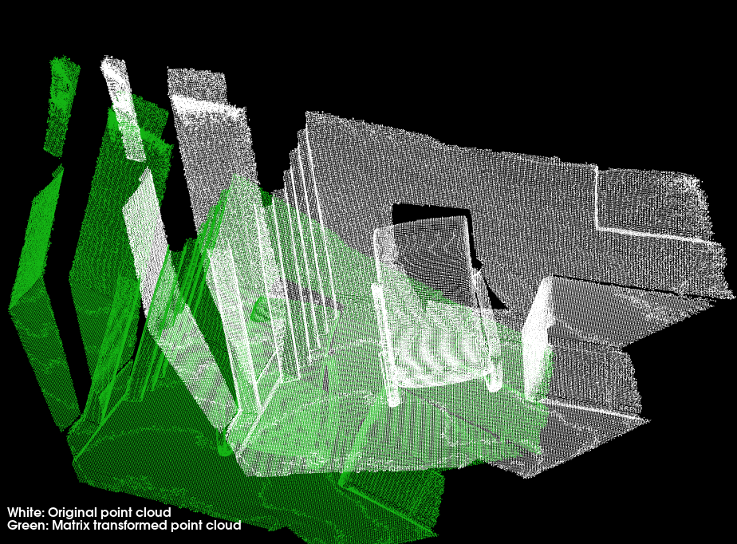
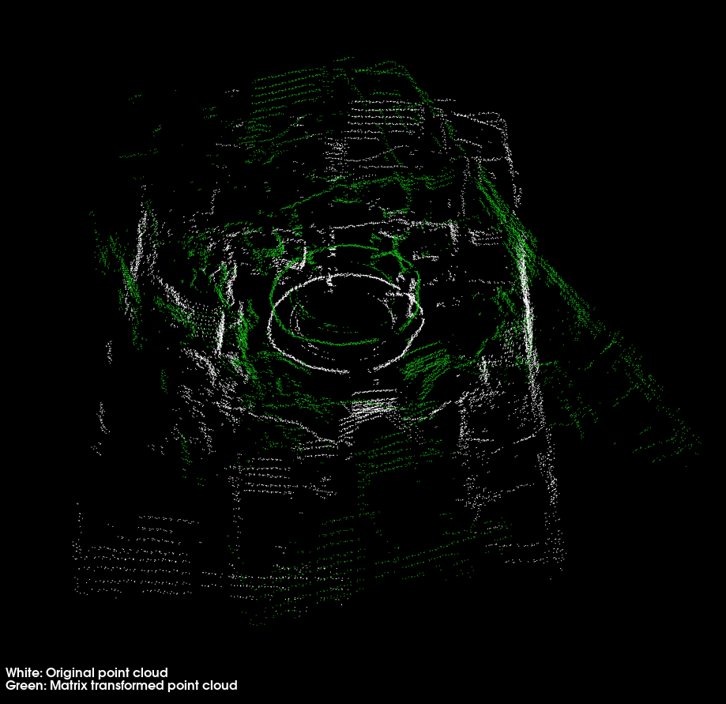

# Point cloud alignment with ICP
This repository contains the C++ code developed to align the transformed point cloud with the original.

## Project Objective
The objective of this project is to implement point-to-point ICP (Iterative Closest Point) using least square optimization to align the transformed point cloud with the original using PCL(Point Cloud Library).

## Dataset
The implementation is done on opensource point cloud dataset ``cloud_bin_[0-2].pcd`` and point cloud of a room ``LiDAR.pcd`` collected using Velodyne Lidar (VLP-16).

|
:--:|:--:
 *Opensource Point Cloud (Source: Open3D)*|*Point Cloud collected using VLP-16*

|
:--:|:--:
 *Initial Point Clouds*|*ICP aligned Point Cloud*
 
 |
:--:|:--:
 *Initial Point Clouds of Room*|*ICP aligned Point Cloud of Room*

